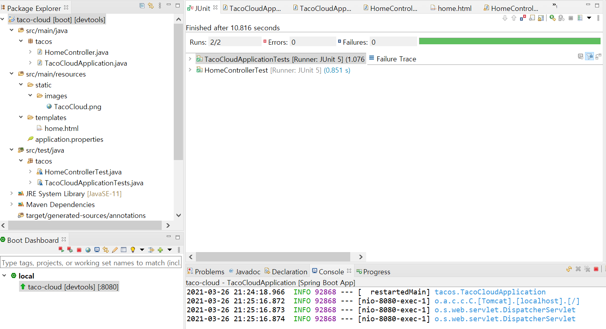

# chapter-1

1.STS Pom.xml

스트링부터 스타터 의존성

* 의존성을 선언하지 않아도 되므로 빌드 파일이 훨씬 작아지고 관리하기 쉬워짐
* 라이브러리 이름이 아닌 기능의 관점으로의 의존성
* 버전 걱정 NO
* 의존성에 지정된 모든 라이브러리가 실행가능 JAR 파일 포함 되어있는지 classpath 확인가

2.@SpringBootApplication

* 실행가능 JAR 파일에서 애플리케이션을 실행하므로 제일 먼저 시작되는 부트스크랩 클래스.
* 최소한의 스프링 구성 포함
* main\(\) 메서드 - JAR 파일이 실행될때 호출되는 실행되는 메서드\(run\(\) 호출\)

3.@SpringBootTest

* junit 스프링 부트 기능 테스트.

4. tomcat 설치 X

5. 기본 예 - 웹 예제 실행 - MockMvc 이용 Junit 실행 / localhost:8080 확인

Spring ioc\(inversion if control\)란?

* 객체의 생성과 소멸의 라이프 사이클\(생명주기\)을 개발자가 아닌 외부 컨테이너에 위임함.
* 컨테이너는 객체를 생성하고 객체간의 의존선을 연결 해주는 역할 수행

Spring bean

* Spring ioc 컨테이너가 관리하는 자바 객체를 빈이라고 한다. applicationContext가 알고 있는 객체, applicationContext가 만들어서 그 안에 담고 있는 객체를 의미
* 기본적으로 싱글톤 방식으로 bean 생성
* @bean 빈 어노테이션  
* @configuration 어노테이션을 글래스에 명시하여 1개 이상의 @bean을 생성 하고 있음을 명시     -&gt;bean, configuration 직접제어가 불가능한 외부라이브러리 또는 설정을 위한 클래스를 bean으로 등록할때 사용
* @component 직접 개발한 클래스를 bean으로 등록 하고자 하는경우 사용\(@controller,@service,@repository 포함\)
* @Autowired - bean을 자동으로 주입 \(클래스에 @Repository 어노테이션 부여\)                                         - Autowired는 기본적으로 디폴트가 required = true,, 이거라서 이거인 경우에는 해당 의존성은 꼭 필요한 대상이므로 주입을 반드시 받아야 한다라는 의미.                                                                    - @Autowired 생략 : 생성자에서 의존성을 주입받는 경우에는 @Autowired 어노테이션 생략 하더라도 자동으로 의존성 주입 가능                                                                                                                  - 다형성 @Autowired : @Autowired 대상이 되는 객체가 여러개가 되면 오류 발생                               =&gt; 해결 방법                                                                                                                                                     1\) @primary : @Autowired 대상이 되는 클래스 중 주입이 되길 원하는 클래스에 어노테이션 부여                                                                                                                                                                          2\)@Qualifier : @Autowired 주입하는 곳에 @Qualifier\("beanid"\) 이용하면 해결 가능                                       3\)@Autowired로 주입받는 객체의 형을 List 로 변   

 

