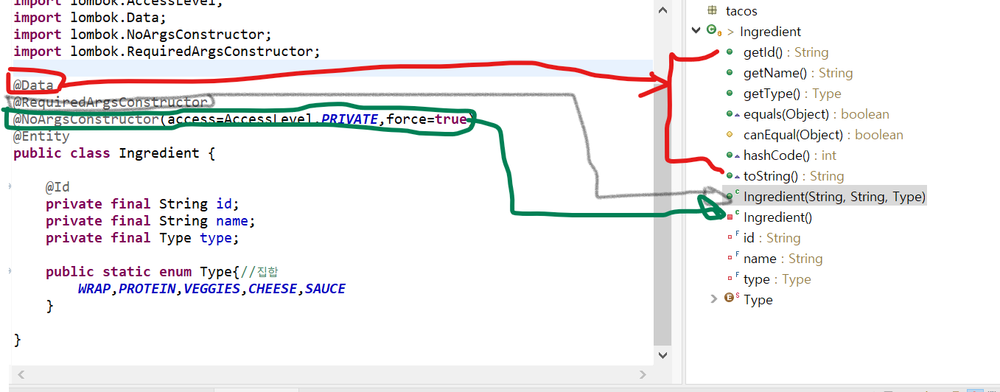

# chapter-3

1.@Repository

* 자동으로 클래스를 찾아서 스프링 어플리케이션 컨텍스트의 빈으로 생성

2. jdbc

* jdbc.query\(SQL,메소드- 쿼리로 생성된 결과 값의 행 개수만큼 호출되며 결과세트의 모든 행을 각각 객체로 생성하고 LIST 저장후 반환\)
* queryForObject\(SQL,메소드-하나의 객체만 반환,검색조건\)
* update\(SQL,인자값\)

@SessionAttributes

* 세션에 계속 유지가 되면서 여러번 요청 가능 

PreparedStatementCreator

* keyholder 사용해서 ID 얻기

```text
private long saveTacoInfo(Taco taco) {
		taco.setCreatedAt(new Date());
		PreparedStatementCreator psc = new PreparedStatementCreatorFactory("insert into Taco( name,createdAt) values (?,?)",
				Types.VARCHAR,Types.TIMESTAMP).newPreparedStatementCreator(Arrays.asList(taco.getName(),new Timestamp(taco.getCreatedAt().getTime())));
		KeyHolder keyHolder = new GeneratedKeyHolder();
		jdbc.update(psc,keyHolder);
		return keyHolder.getKey().longValue();
	}
```

 SimpleJdbcInsert 

* 사용해서 ID 얻기

```text
@Autowired
	public jdbcOrderRepository(JdbcTemplate jdbc) {
		this.orderInserter = new SimpleJdbcInsert(jdbc)
			.withTableName("Taco_Order")
			.usingGeneratedKeyColumns("id");
		
		this.orderTacoInserter = new SimpleJdbcInsert(jdbc)
				.withTableName("Taco_Order_Tacos");
		
		this.objectMapper = new ObjectMapper()
  //objectMapper.convertValue(order, Map.class);
  // objectMapper는 order Vo를 map 형태로 변
	}
	
	private long saveOrderDetails(Order order){
		//objectMapper는 order 를 맵으로 변환
		Map<String,Object> values = objectMapper.convertValue(order, Map.class);
		values.put("placedAt", order.getPlacedAt());
		//objectMapper는 Date 타입을 long 타입으로 변환하므로 한번더 해주기
		
		long orderId = orderInserter.executeAndReturnKey(values)
				.longValue();
		return orderId;
	}
	
```

Coverter - 데이터 타입을 변환

@ModelAttribute

* 역할 : @ModelAttribute 어노테이션이 붙은 객체가 model에 추가가 되어서 Http로 넘어가서 뷰에서 사용가능 

```text
@GetMapping
	public String showDesignForm(Model model) {
		
		model.addAttribute("taco",new Taco());
		System.out.println(model.getAttribute("cheese"));
		return "design";
		
	}
	
	<form method = "POST" th:object="${taco}">
```

* 역할2:  어떤 컨트롤러 클래스 안에있는 특정 메소드에 @ModelAttribute 어노테이션이 붙어 있으면 해당 컨트롤러 클래스의 모든 @RequestMapping 어노테이션이 붙은 메소드가 호출될 때마다 그 메소드 호출 전에 @ModelAttribute가 붙은 메소드가 일단 먼저 호출되고 그 이후 @RequestMapping이 붙은 메소드가 호출되는데 이때 @ModelAttribute 메소드 실행 결과로 리턴되는 객체\(데이터\)는 자동으로 @RequestMapping 어노테이션이 붙은 메소드의 Model에 저장이되고 그 이후에 .jsp\(View\)에서 @ModelAttribute 메소드가 반환한 데이터를 사용할수 있다.   출처: [https://developer-joe.tistory.com/224?category=743305](https://developer-joe.tistory.com/224?category=743305) \[코드 조각-Android, Java, Spring, JavaScript, C\#, C, C++, PHP, HTML, CSS, Delphi\]

```text
	@GetMapping
	public String showDesignForm(Model model) {
		
		model.addAttribute("taco",new Taco());
		System.out.println(model.getAttribute("cheese"));
		return "design";
		
	}
	//@ModelAttribute 각 객체가 생성이 되도록
	@ModelAttribute(name = "order")
	public Order order() {
		return new Order();
	}
	//@ModelAttribute 각 객체가 생성이 되도록
	@ModelAttribute(name = "taco")
	public Taco taco() {
		return new Taco();
	}
```

* 역할3 : 

   1\)  @ModelAttribute Order order 는 세션에 같은 이름으로 order 있는지 확인  세션에서 꺼내서  @ModelAttribute Order order여기에 자동저장.

 2\) order.addDesign\(saved\); 커맨드객체 \( Controller 클래스 의 메소드에 매개변수로 VO 객체가 선언되어 있는것\) form태그,즉 뷰에서 가져온것도 자동으로 할당 

```text
@RequestMapping("/design")
@SessionAttributes("order")// 세션에 다수로 사용 - 여러개 타코 주문할 수 있도록
public class DesignTacoController {


	
	@GetMapping
	public String showDesignForm(Model model) {
		
		model.addAttribute("taco",new Taco());
		System.out.println(model.getAttribute("cheese"));
		return "design";
		
	}
	//@ModelAttribute 각 객체가 생성이 되도록
	@ModelAttribute(name = "order")
	// 세션에 다수로 사용
	public Order order() {
		return new Order();
	}
	//@ModelAttribute 각 객체가 생성이 되도록
	@ModelAttribute(name = "taco")
	public Taco taco() {
		return new Taco();
	}
	
	// @ModelAttribute Order 
	// order 매개변수의 값이 모델로부터 전달되어야 한다는것과 스프링MVC가 이 매개변수에 요청 매개변수를 바인딩X
	@PostMapping
	public String processDesign(@Valid Taco disign,Errors errors,@ModelAttribute Order order) {
		
		if(errors.hasErrors()) {
			return "design";
		}
		/* log.info("ProcessDesign : " + disign); */
		Taco saved = tacoRepo.save(disign);
		order.addDesign(saved);
		
		return "redirect:/orders/current";
	}
```

스프링 데이터 JPA 사용해보기

* JPA 개체로 선언 - @Entity 애노테이션 추가  =&gt; @id 를 지정하여 이 속성이 데이터베이스의 개체를 고유하게 식별..
* 설
  * @NoArgsConstructor\(access=AccessLevel.PRIVATE,force=true\) =&gt; 인자가 없는 생성자 , 기본생성자 생성 

    AccessLevel.PRIVATE 는 클래스 외부에서 사용 불가, final 속성이 들어 있으 force를 true로 설정하여 lombok이 자동생성한 생성자에서 null로 설정한다.

  * @DATA : 인자가 있는 생성자를 자동 생성
  * @requiredArgsConstructor : final ,Notnull 필드값만 파라미터로 받는 생성자  생성  
  * @GeneratedValue\(strategy = GenerationType.AUTO\) : 데이터베이스가 자동으로 생성 
  * @ManyToMany\(targetEntity = Ingredient.class\) : 두개의 객체 사의 관계 다대다
  * @PrePersist :현재 객체가 실행되기전에 먼저 실행 
  * @Table\(name="Taco\__Order"\) : Taco\__Order 테이블에 저장해달라.



JPA 리퍼지터리

* CrudRepository 인터베이스에는 CRUD 메소드가 선언되어 있다.=&gt;CrudRepository&lt;Ingredient,String&gt; 첫번째 매개변수는 저장되는 개체타입, 두번째 매개변수는 개체 IT 속성의 타입.

